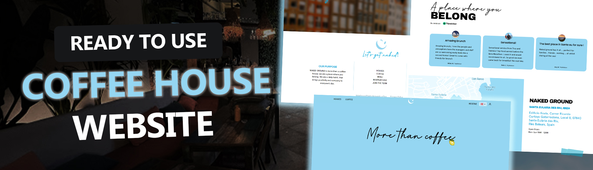

<div align="center">
  <br />
      
  <br />

  <h1 align="center">Coffee House Website</h1><div>
    
    
  </div>
   <div align="center">
          A welcoming online space reflecting the unique vibe coffee houses, offering a glimpse into our coffee culture, menu offerings, daily activities, and table reservations.
    </div>

</div>

## 📋 <a name="table">Table of Contents</a>

1. 🤖 [Introduction](#introduction)
2. ⚙️ [Tech Stack](#tech-stack)
3. 🔋 [Features](#features)
4. 🤸 [Quick Start](#quick-start)

## <a name="introduction">🤖 Introduction</a>

The NAKED GROUND website is designed to transport visitors into the heart of coffee house culture. It features an intuitive layout, guiding users through the exploration of distinct locations, specially curated coffee and menu, daily happenings, and how to book a visit or reserve table with fantastic view.

## <a name="tech-stack">⚙️ Tech Stack</a>

- React.js
- Sass

## <a name="features">🔋 Features</a>

👉 **Engaging, thematic design**: Reflects the warm, inviting atmosphere of Coffee House, ensuring a seamless online to in-person experience.

👉 **Interactive menu exploration**: Allows users to discover coffee and food offerings in a visually engaging manner.

👉 **Responsive and accessible**: Ensures a great user experience across all devices, with a focus on accessibility and more, focusing on user engagement.

## <a name="quick-start">🤸 Quick Start</a>

Follow these steps to set up the project locally on your machine.

**Prerequisites**

Make sure you have the following installed on your machine:

- [Git](https://git-scm.com/)
- [Node.js](https://nodejs.org/en)
- [npm](https://www.npmjs.com/) (Node Package Manager)

**Cloning the Repository**

```bash
git clone https://github.com/maxbezs/nakedground.git
cd nakedground
```

**Installation**

Install the project dependencies using npm:

```bash
npm install
```

**Running the Project**

```bash
npm start
```

Open [http://localhost:3000](http://localhost:3000) in your browser to view the project.

---
